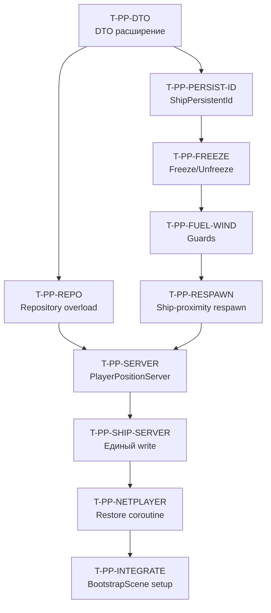

# Player-Ship Position Persistence — Финальный план (Merged)

> **Статус:** План ✅ | Реализация: ✅
> **Цель:** Привязать респавн и сохранение позиции игрока к кораблю. Игрок, вышедший в полёте, при возвращении появляется у своего корабля (зависшего в воздухе). При падении с корабля — респавн на нём же (если ближе дефолтной точки). Корабль без пилота замирает, не тратит топливо, не сдувается ветром.
> **Дата:** 2026-07-21
> **Основание:** Анализ PLAYER_SHIP_POSITION_PERSISTENCE.md (v1), SHIP_POSITION_PERSISTENCE_FINAL.md, фактического кода ShipController (FixedUpdate, AddPilot/RemovePilot), NetworkPlayer, PlayerRespawnTracker, WindManager.
> **Связанные тикеты:** T-PERSIST-* (ship persistence), T-PP-* (player persistence) — новые тикеты в этом плане.
> **Предшественник:** `docs/Character/respawn/PLAYER_SHIP_POSITION_PERSISTENCE.md` — этот план является его ревизией, а не заменой.

---

## 1. Анализ расхождений с v1 (PLAYER_SHIP_POSITION_PERSISTENCE.md)

> **Принцип:** План v1 верен в основном. Ниже — что добавлено, скорректировано, что нестыкуется.

| # | Аспект | v1 (существующий план) | Финал (этот документ) | Причина коррекции |
|---|--------|----------------------|----------------------|-------------------|
| **D1** | `_frozenByNoPilot` freeze — только zero velocity в RemovePilotRpc | Zero velocity ОДИН раз в момент freeze | Zero velocity **КАЖДЫЙ FixedUpdate** пока frozen | `ApplyAntiGravity()` добавляет upward force каждый кадр. После одноразового zero антигравитация дрейфует корабль вверх за ~1-2 сек |
| **D2** | `RemovePilotRpc` freeze guard | `_pilots.Count == 0 && _engineRunning && !_hasNpcPilot` | То же + проверка `!_frozenByNoPilot` чтобы не дублировать freeze | Защита от повторного freeze при уже frozen |
| **D3** | OnNetworkDespawn → RemovePilot | Не описан | Уже есть: `NetworkPlayer.OnNetworkDespawn` строка 480 уже вызывает `_currentShip.RemovePilot(OwnerClientId)` | Подтверждено кодом — disconnect уже обрабатывается правильно |
| **D4** | Proximity ship respawn | НЕ описан | Добавлен §5 | Новая функциональность от пользователя |
| **D5** | `PerformRespawn` vs freeze | Только новый код respawn | PlayerRespawnTracker.PerformRespawn требует расширения: проверка на корабль перед teleport | Без этого падение с корабля → респавн на дефолтной точке а не на корабле |
| **D6** | `_frozenByNoPilot` должен блокировать antiGravity | Не указано | `ApplyAntiGravity()` пропускается при `_frozenByNoPilot` | Иначе antiGravity добавляет силу, velocity-zeroing её гасит — лишняя работа физики |
| **D7** | `_frozenByNoPilot` и Fuel regen | Fuel block (idle consumption) | regen НЕ блокируется — корабль пассивно восстанавливает топливо в воздухе | Игрок возвращается к кораблю с дозаправленным баком — позитивный gameplay |
| **D8** | `ApplyExternalForce` при frozen | Не рассмотрено | Guard: `!_frozenByNoPilot` в `ApplyExternalForce` | Никто не должен толкать frozen корабль (физика выключена) |
| **D9** | Global wind через WindManager | Guard на `_frozenByNoPilot` в ApplyGlobalWind | То же + `WindManager._shipWindMultiplier` сохраняет 0-force если глобальный ветер тотально выключен | Безопасность на уровне WindManager уже есть |
| **D10** | PlayerPositionServer restore timing | 4s delay | **5s delay** (после ShipPositionServer 3.5s + 1.5s запас) | 4s слишком близко к 3.5s; на медленных серверах restore корабля может не завершиться к моменту restore игрока |
| **D11** | ShipPositionServer.saveInterval | 5s | 5s (как есть) | Без изменений |
| **D12** | Сохранение players в том же JSON что ships | Перезапись через _repo.LoadAll→players→SaveAll | **Единый write** — ShipPositionServer синхронизирует players через PlayerPositionServer.Instance.GetPendingPlayers() | Два независимых write в один файл — риск потери данных при краше между ними |

### Сводка архитектурных решений

```
Файл JSON (ShipPositions.json):
  { ships: [...], players: [...] }

ShipPositionServer (5s):
  └→ собирает ShipPositionSaveData со всех ShipController
  └→ забирает PlayerPositionSaveData из PlayerPositionServer
  └→ единый File.WriteAllText(ships + players)

PlayerPositionServer (5s):
  └→ собирает PlayerPositionSaveData со всех NetworkPlayer
  └→ хранит в памяти _pendingPlayers
  └→ ShipPositionServer забирает через GetPendingPlayers()
  └→ restore вызывается через RestorePlayer(clientId)
```

---

## Реализация (2026-07-21)

**Все 10 этапов плана выполнены.** Коммиты: `269d4ad`, `8d03865`, `bf6fbf9`, `785f250`.

### Отклонения от плана

| # | Пункт плана | Реализация | Причина |
|---|-------------|------------|---------|
| **D12** | §10 Out of scope: engine после restore всегда OFF | `isEngineRunning` сохранён и восстановлен | Критично: корабль падал после рестарта сервера |
| **D5** | `TryFindNearestOwnedShip` через `MetaRequirementRegistry` | Добавлен `LastShip` в NetworkPlayer как основной механизм | `CanPlayerUse` зависит от KeyRodInstanceWorld — ненадёжно |
| — | Нет в плане | Кнопка «СПАСЕНИЕ» в EscMenu → `ForceDefaultRespawnServerRpc` | Запрошено: экстренный ТП при застревании

### Финальный flow

- **Freeze:** `_frozenByNoPilot` → ветер/топливо/антиграв пропущены, velocity=0 каждый кадр
- **Save:** ShipPositionServer → PlayerPositionServer → единый write `ShipPositions.json`
- **Restore (restart):** позиция + `SetEngineRunning(true)` + `ApplyPersistenceFreeze()`
- **Restore (connect):** 5s delay → `RestorePlayer(clientId)` → телепорт к кораблю или на позицию
- **Respawn:** `IsInShip` → `LastShip` → `TryFindNearestOwnedShip` → `RespawnManager`
- **Спасение:** EscMenu → `ForceDefaultRespawnServerRpc` → только `RespawnManager`

---
## 2. Общая схема (revised)

```
Player in ship, flying
  → disconnect / exit (F)
    → SubmitSwitchModeRpc (выход) / OnNetworkDespawn
      → ShipController.RemovePilot(clientId)
        → RemovePilotRpc:
          - _pilots.Remove(clientId)
          - if _pilots.Count == 0 && _engineRunning && !_hasNpcPilot:
            → _rb.linearVelocity = Vector3.zero
            → _rb.angularVelocity = Vector3.zero
            → _frozenByNoPilot = true
            → _sumThrust = 0, _sumYaw = 0, …

ShipController.FixedUpdate (каждый кадр, если _frozenByNoPilot):
  → isIdle = true (без изменений)
  → avgThrust/yaw/pitch = 0 (без изменений)
  → idle fuel consumption: SKIP (guard: !_frozenByNoPilot) ✅ v1
  → Wind: SKIP (guard: !_frozenByNoPilot) ✅ v1
  → ApplyAntiGravity: SKIP (guard: !_frozenByNoPilot) 🔴 D6 — новое
  → ApplyExternalForce: SKIP (guard: !_frozenByNoPilot) 🔴 D8 — новое
  → ClampVelocity: post-clamp zero velocity if frozen 🔴 D1 — новое
    → _rb.linearVelocity = Vector3.zero
    → _rb.angularVelocity = Vector3.zero

PlayerPositionServer (каждые 5s, на IsServer):
  → FindObjectsByType<NetworkPlayer>
  → собирает PlayerPositionSaveData (clientId, pos, inShip, shipId)
  → хранит _pendingPlayers

ShipPositionServer (каждые 5s, на IsServer):
  → собирает ShipPositionSaveData
  → забирает _pendingPlayers из PlayerPositionServer
  → единый write ShipPositions.json

Player connects
  → NetworkPlayer.OnNetworkSpawn
    → RegisterWithCombatServer (существующий)
    → StartCoroutine(RestorePlayerPositionCoroutine) — 5s delay 🔴 D10
      → PlayerPositionServer.RestorePlayer(clientId)
        → был на корабле (inShip=true, shipId)?
          → ShipPositionServer уже восстановил корабль (3.5s)
          → телепорт игрока на ship.GetExitPosition()
        → не на корабле?
          → телепорт на последнюю сохранённую позицию
        → нет save (первый вход)?
          → no-op, стандартный спавн

Player falls off ship / death
  → PlayerRespawnTracker.PerformRespawn
    → PlayerPositionServer.TryShipRespawn(player)
      → если игрок был на корабле (inShip=true):
        → телепорт на ship.GetExitPosition()
      → иначе: стандартный PerformRespawn через RespawnManager
```

---

## 3. Детальные изменения — по файлам

### 3.1 ShipController.cs — freeze + fuel + wind + velocity hold

#### Новые поля

```csharp
// T-PLAYER-PERSIST (D1, D6): заморозка при отсутствии пилотов
private bool _frozenByNoPilot = false;
```

#### RemovePilotRpc — freeze

```csharp
[Rpc(SendTo.Everyone)]
private void RemovePilotRpc(ulong clientId, RpcParams rpcParams = default)
{
    _pilots.Remove(clientId);

    // T-PLAYER-PERSIST: если пилотов не осталось и двигатель включён — заморозка
    if (_pilots.Count == 0 && _engineRunning && !_hasNpcPilot && !_frozenByNoPilot)
    {
        if (_rb != null)
        {
            _rb.linearVelocity = Vector3.zero;
            _rb.angularVelocity = Vector3.zero;
        }
        _frozenByNoPilot = true;

        // Сбросить накопленный ввод
        _sumThrust = 0; _sumYaw = 0; _sumPitch = 0; _sumVertical = 0;
        _boostCount = 0; _inputCount = 0;

        if (_debugLog)
            Debug.Log($"[ShipController:{name}] Frozen by no pilot. Engine ON, fuel/wind suspended.");
    }
}
```

#### AddPilotRpc — unfreeze

```csharp
[Rpc(SendTo.Everyone)]
private void AddPilotRpc(ulong clientId, RpcParams rpcParams = default)
{
    _pilots.Add(clientId);
    _frozenByNoPilot = false; // T-PLAYER-PERSIST: разморозка
    enabled = true;
}
```

#### FixedUpdate — idle fuel guard (v1 строка 1261)

```csharp
// ENGINE-STATE: idle расход топлива
// T-PLAYER-PERSIST: frozen = топливо не тратится
if (_engineRunning && !_hasNpcPilot && fuelSystem != null && !engineStalled && isIdle && !_frozenByNoPilot)
{
    fuelSystem.ConsumeFuel(fuelSystem.IdleConsumptionRate * dt);
}
```

#### FixedUpdate — wind guard (v1 строка 1469-1473)

```csharp
// T-PLAYER-PERSIST: frozen = ветер не применяется
if (!_frozenByNoPilot)
{
    ApplyWind(dt);
    ApplyGlobalWind(dt);
}
```

#### FixedUpdate — anti-gravity guard (НОВОЕ — D6)

В `ApplyAntiGravity()`:

```csharp
private void ApplyAntiGravity()
{
    // T-PLAYER-PERSIST: frozen = антигравитация не нужна (velocity zeroится)
    if (_frozenByNoPilot) return;
    if (antiGravity <= 0f) return;
    if (!_engineRunning && !_hasNpcPilot) return;
    float gravityCompensation = _rb.mass * Mathf.Abs(Physics.gravity.y) * antiGravity;
    _rb.AddForce(Vector3.up * gravityCompensation, ForceMode.Force);
}
```

#### FixedUpdate — post-physics velocity hold (НОВОЕ — D1)

После `ClampVelocity()` в конце FixedUpdate:

```csharp
// T-PLAYER-PERSIST (D1): каждый кадр держим velocity = 0 пока frozen
// antiGravity уже пропущен, но любые residual forces (meziy, external) гасим
if (_frozenByNoPilot && _rb != null)
{
    if (_rb.linearVelocity.sqrMagnitude > 0.001f)
        _rb.linearVelocity = Vector3.zero;
    if (_rb.angularVelocity.sqrMagnitude > 0.001f)
        _rb.angularVelocity = Vector3.zero;
}
```

> **Почему не isKinematic:** isKinematic отключает ВСЮ физику. Но у нас есть сценарий: пилот вышел при включённом антиграве, затем заходит снова — нужно плавное переключение. isKinematic → !isKinematic даёт резкий «налёт» гравитации за 1 кадр. С velocity-zeroing физика остаётся активной, антигравитация продолжает работать (просто каждый кадр velocity сбрасывается), и при входе пилота физика уже стабильна.

#### ApplyExternalForce guard (НОВОЕ — D8)

```csharp
public void ApplyExternalForce(Vector3 force)
{
    if (!IsServer || _rb == null) return;
    if (_frozenByNoPilot) return; // T-PLAYER-PERSIST: frozen = игнор
    _rb.AddForce(force, ForceMode.Force);
}
```

#### ShipPersistentId (из T-PERSIST-ID, копируем из SHIP_POSITION_PERSISTENCE_FINAL.md)

```csharp
[Header("Persistence (T-PERSIST)")]
[Tooltip("Стабильный идентификатор для сохранения позиции. Если пусто — генерируется: sceneName/gameObject.name.")]
[SerializeField] private string _shipPersistentId = "";

public string ShipPersistentId
{
    get
    {
        if (!string.IsNullOrEmpty(_shipPersistentId))
            return _shipPersistentId!;
        var scene = gameObject.scene;
        _shipPersistentId = $"{scene.name}/{gameObject.name}";
        return _shipPersistentId;
    }
}
```

---

### 3.2 NetworkPlayer.cs — restore on connect

#### OnNetworkSpawn — новая корутина

Добавить после `RegisterWithCombatServer()` (строка ~313):

```csharp
// T-PLAYER-PERSIST: восстановить позицию из save при connect
// Задержка 5s — после ShipPositionServer.RestoreCoroutine (3.5s)
// и PlayerPositionServer инициализации.
// D10: 5s вместо 4s для защиты от timing race на медленных серверах.
if (IsServer)
{
    StartCoroutine(RestorePlayerPositionCoroutine());
}
```

#### RestorePlayerPositionCoroutine

```csharp
private System.Collections.IEnumerator RestorePlayerPositionCoroutine()
{
    yield return new WaitForSeconds(5f);

    if (PlayerPositionServer.Instance != null)
    {
        bool restored = PlayerPositionServer.Instance.RestorePlayer(this);
        if (restored)
        {
            // Сбросить fall detection чтобы не тригернуть респавн после телепорта
            var tracker = GetComponent<PlayerRespawnTracker>();
            if (tracker != null) tracker.ResetFallTimer();
        }
    }
    else
    {
        Debug.LogWarning($"[NetworkPlayer] PlayerPositionServer.Instance == null — skip restore for client={OwnerClientId}");
    }
}
```

> **Почему IsServer, а не IsOwner:** Решение позиции — сервер-авторитативно. `OnNetworkDespawn` уже серверный. Клиент получает позицию через `NetworkTransform` автоматически.

---

### 3.3 PlayerRespawnTracker.cs — ship-proximity respawn (НОВОЕ)

#### PerformRespawn — ship-first logic (D5)

```csharp
private bool PerformRespawn()
{
    if (_isRespawning) return false;
    _isRespawning = true;
    _fallStartTime = float.MaxValue;

    // T-PLAYER-PERSIST: если игрок был на корабле — респавним на нём
    var np = GetComponent<NetworkPlayer>();
    if (np != null && np.IsInShip && np.CurrentShip != null && np.CurrentShip.IsSpawned)
    {
        Vector3 shipPos = np.CurrentShip.GetExitPosition();
        TeleportToClientRpc(shipPos);
        if (_debugLog)
            Debug.Log($"[PlayerRespawnTracker] Ship-proximity respawn for client={OwnerClientId} at ship exit {shipPos}");

        if (IsServer && !IsClient)
            Invoke(nameof(ResetRespawningFlag), 0.5f);
        return true;
    }

    // T-PLAYER-PERSIST: поиск ближайшего owned корабля (D5)
    if (TryFindNearestOwnedShip(np, out Vector3 nearestShipPos))
    {
        TeleportToClientRpc(nearestShipPos);
        if (_debugLog)
            Debug.Log($"[PlayerRespawnTracker] Nearest-owned-ship respawn for client={OwnerClientId} at {nearestShipPos}");

        if (IsServer && !IsClient)
            Invoke(nameof(ResetRespawningFlag), 0.5f);
        return true;
    }

    // Стандартный респавн через RespawnManager
    if (_respawnManager == null)
    {
        // ... существующий код ...
    }

    int index = _currentRespawnIndex >= 0 ? _currentRespawnIndex : 0;
    Vector3 targetPos = _respawnManager.GetEffectivePosition(index);
    // ... существующий код ...
}
```

#### TryFindNearestOwnedShip (новый метод)

```csharp
/// <summary>
/// T-PLAYER-PERSIST (D5): поиск ближайшего owned корабля для респавна.
/// </summary>
private bool TryFindNearestOwnedShip(NetworkPlayer np, out Vector3 nearestPos)
{
    nearestPos = Vector3.zero;

    if (np == null || NetworkManager.Singleton == null) return false;

    ulong clientId = np.OwnerClientId;
    var allShips = FindObjectsByType<ShipController>(FindObjectsSortMode.None);
    ShipController nearestShip = null;
    float nearestDistSq = float.MaxValue;
    float proximityThresholdSq = 200f * 200f; // 200m — настраиваемый порог

    foreach (var ship in allShips)
    {
        if (!ship.IsSpawned) continue;

        // Проверка владения через MetaRequirementRegistry
        bool isOwned = MetaRequirementRegistry.Instance != null
            && MetaRequirementRegistry.Instance.CanPlayerUse(clientId, ship.NetworkObjectId);

        if (!isOwned) continue;

        float distSq = (ship.transform.position - transform.position).sqrMagnitude;
        if (distSq < nearestDistSq && distSq <= proximityThresholdSq)
        {
            nearestDistSq = distSq;
            nearestShip = ship;
        }
    }

    if (nearestShip != null)
    {
        nearestPos = nearestShip.GetExitPosition();
        return true;
    }

    return false;
}
```

> **Дизайн решения:** 
> - `MetaRequirementRegistry.CanPlayerUse` уже проверяет владение кораблём (через инвентарь + ключи)
> - Threshold 200m — корабль в зоне видимости; можно вынести в `[SerializeField]`
> - Если несколько owned кораблей рядом — выбирается ближайший

---

### 3.4 PlayerPositionServer — новый файл

**Путь:** `Assets/_Project/Scripts/Core/ShipPosition/PlayerPositionServer.cs`
**Namespace:** `ProjectC.Core.ShipPosition`

```csharp
using System;
using System.Collections.Generic;
using Unity.Netcode;
using UnityEngine;
using ProjectC.Player;

namespace ProjectC.Core.ShipPosition
{
    /// <summary>
    /// T-PLAYER-PERSIST: Server-only persistence позиций игроков.
    /// Save: каждые 5s, данные через ShipPositionServer (единый write).
    /// Restore: при OnNetworkSpawn игрока (5s delay).
    /// </summary>
    public class PlayerPositionServer : MonoBehaviour
    {
        public static PlayerPositionServer Instance { get; private set; }

        [SerializeField] private bool _debugMode = true;

        // ── pending data (забирается ShipPositionServer для единого write) ──
        private List<PlayerPositionSaveData> _pendingPlayers = new();
        private readonly object _pendingLock = new();

        private void Awake()
        {
            if (Instance != null) { Destroy(gameObject); return; }
            Instance = this;
            DontDestroyOnLoad(gameObject);
        }

        /// <summary>
        /// Вызывается из ShipPositionServer.Update (каждые 5s) для сбора данных.
        /// </summary>
        public void CollectPlayers()
        {
            if (!IsServerSafe()) return;

            var allPlayers = FindObjectsByType<NetworkPlayer>(FindObjectsSortMode.None);
            var collected = new List<PlayerPositionSaveData>(allPlayers.Length);

            foreach (var np in allPlayers)
            {
                if (!np.IsSpawned) continue;
                if (GetComponent<NetworkPlayerSpawner>() != null) continue; // scene-placed ghost

                bool inShip = np.IsInShip;
                string shipId = "";
                if (inShip && np.CurrentShip != null)
                    shipId = np.CurrentShip.ShipPersistentId;

                Vector3 pos = np.GetEffectivePosition();

                collected.Add(new PlayerPositionSaveData
                {
                    clientId = np.OwnerClientId,
                    px = pos.x, py = pos.y, pz = pos.z,
                    inShip = inShip,
                    shipPersistentId = shipId,
                    savedAtUnix = DateTimeOffset.UtcNow.ToUnixTimeSeconds()
                });
            }

            lock (_pendingLock)
            {
                _pendingPlayers = collected;
            }

            if (_debugMode)
                Debug.Log($"[PlayerPositionServer] Collected {collected.Count} players for save");
        }

        /// <summary>
        /// Вызывается из ShipPositionServer для получения pending players.
        /// </summary>
        public List<PlayerPositionSaveData> GetPendingPlayers()
        {
            lock (_pendingLock)
            {
                return new List<PlayerPositionSaveData>(_pendingPlayers);
            }
        }

        /// <summary>
        /// Restore позиции игрока при connect.
        /// </summary>
        /// <returns>true если restore выполнен (teleport).</returns>
        public bool RestorePlayer(NetworkPlayer np)
        {
            if (!IsServerSafe()) return false;

            ulong clientId = np.OwnerClientId;
            var repo = new JsonShipPositionRepository();
            var allData = repo.LoadAll();

            // Ищем по clientId (НОВОЕ D12: поиск среди players из того же файла)
            var match = allData.players?.Find(p => p.clientId == clientId);
            if (match == null)
            {
                if (_debugMode)
                    Debug.Log($"[PlayerPositionServer] No save for client={clientId} — standard spawn");
                return false;
            }

            Vector3 targetPos;

            if (match.inShip && !string.IsNullOrEmpty(match.shipPersistentId))
            {
                // Игрок был на корабле — ищем корабль
                var allShips = FindObjectsByType<ShipController>(FindObjectsSortMode.None);
                var ship = Array.Find(allShips, s => s.IsSpawned && s.ShipPersistentId == match.shipPersistentId);

                if (ship != null)
                {
                    targetPos = ship.GetExitPosition();
                    TeleportPlayer(np, targetPos);
                    if (_debugMode)
                        Debug.Log($"[PlayerPositionServer] Player {clientId} restored to ship '{match.shipPersistentId}' at {targetPos}");
                    return true;
                }

                if (_debugMode)
                    Debug.Log($"[PlayerPositionServer] Player {clientId} was in ship '{match.shipPersistentId}' but ship not found — fallback to saved pos");
            }

            // Fallback: сохранённая позиция
            targetPos = new Vector3(match.px, match.py, match.pz);
            TeleportPlayer(np, targetPos);
            if (_debugMode)
                Debug.Log($"[PlayerPositionServer] Player {clientId} restored to position {targetPos}");
            return true;
        }

        private void TeleportPlayer(NetworkPlayer np, Vector3 position)
        {
            var controller = np.GetComponent<CharacterController>();
            if (controller != null) controller.enabled = false;
            np.transform.position = position;
            if (controller != null) controller.enabled = true;
            Physics.SyncTransforms();
        }

        private static bool IsServerSafe()
        {
            var nm = NetworkManager.Singleton;
            return nm != null && nm.IsServer;
        }
    }
}
```

---

### 3.5 ShipPositionSaveData.cs — дополнение DTO

Добавить `PlayerPositionSaveData` в существующий `ShipPositionSaveData.cs`:

```csharp
[Serializable]
public class PlayerPositionSaveData
{
    public ulong clientId;           // NGO NetworkClientId
    public float px, py, pz;         // world position
    public bool inShip;              // игрок был на корабле в момент save?
    public string shipPersistentId;  // _shipPersistentId корабля (если inShip)
    public long savedAtUnix;
}
```

Дополнить `ShipPositionListWrapper`:

```csharp
[Serializable]
public class ShipPositionListWrapper
{
    public List<ShipPositionSaveData> ships = new List<ShipPositionSaveData>();
    public List<PlayerPositionSaveData> players = new List<PlayerPositionSaveData>(); // T-PLAYER-PERSIST
}
```

---

### 3.6 ShipPositionServer.cs — единый write с players

В методе `Update` (каждые 5s) — после сбора ships забираем players из `PlayerPositionServer` и пишем единым файлом:

```csharp
void Update()
{
    if (!IsServerSafe()) return;
    if (Time.time < _nextSaveTime) return;
    _nextSaveTime = Time.time + _saveIntervalSec;

    // 1. Собираем ships (существующий код)
    var allShips = FindObjectsByType<ShipController>(FindObjectsSortMode.None);
    var shipData = new List<ShipPositionSaveData>(allShips.Length);
    foreach (var ship in allShips) { /* существующий код */ }

    // 2. T-PLAYER-PERSIST (D12): забираем players из PlayerPositionServer
    List<PlayerPositionSaveData> playerData = new();
    if (PlayerPositionServer.Instance != null)
    {
        PlayerPositionServer.Instance.CollectPlayers();
        playerData = PlayerPositionServer.Instance.GetPendingPlayers();
    }

    // 3. Единый write
    var wrapper = new ShipPositionListWrapper { ships = shipData, players = playerData };
    _repo.SaveAll(wrapper);  // новый overload: SaveAll(ShipPositionListWrapper)

    if (_debugMode)
        Debug.Log($"[ShipPositionServer] Saved {shipData.Count} ships + {playerData.Count} players");
}
```

**ShipPositionRepository.cs** — новый перегруженный `SaveAll`:

```csharp
public void SaveAll(ShipPositionListWrapper wrapper)
{
    lock (_ioLock)
    {
        try
        {
            var json = JsonUtility.ToJson(wrapper, prettyPrint: false);
            File.WriteAllText(FilePath, json);
        }
        catch (Exception ex)
        {
            Debug.LogError($"[JsonShipPositionRepository] SaveAll failed: {ex.Message}");
        }
    }
}
```

`LoadAll()` возвращает `ShipPositionListWrapper` (с пустыми ships и players если файла нет).

---

## 4. Восстановление после shutdown (server crash)

```
Server start
  → Scenes load → ScenePlacedObjectSpawner spawns ships
  → NpcShipServer.OnNetworkSpawn (2s → DiscoverNpcShipsDelayed)
  → ShipPositionServer.OnServerStarted (3.5s → RestoreCoroutine)
    → _repo.LoadAll() — читает ships + players
    → ApplyRestore для каждого ShipController (матчинг по _shipPersistentId)
    → PlayerPositionServer загружает players из того же файла
      → _savedPlayers = data.players (для использования при connect)

Player connects (в любой момент после restore)
  → NetworkPlayer.OnNetworkSpawn → 5s delay
  → PlayerPositionServer.RestorePlayer(clientId)
    → ищет по clientId среди _savedPlayers
    → inShip=true → телепорт к кораблю
    → inShip=false → телепорт на позицию
```

### Важно: порядок загрузки

```csharp
// ShipPositionServer.RestoreCoroutine (3.5s delay)
void RestoreCoroutine()
{
    yield return new WaitForSeconds(3.5f);
    var wrapper = _repo.LoadAll();

    // D12: загружаем players в PlayerPositionServer
    if (PlayerPositionServer.Instance != null)
        PlayerPositionServer.Instance.LoadSavedPlayers(wrapper.players);

    // Restore ships (существующий код)
    foreach (var ship in allShips) { ... }
}
```

---

## 5. Proximity ship respawn (D4, D5)

### Сценарии респавна:

| # | Сценарий | Поведение | Где |
|---|----------|-----------|-----|
| 1 | Игрок упал с корабля (был в полёте, пеший, упал с палубы) | Респавн на **этом же корабле** (GetExitPosition) | `PerformRespawn` → `np.IsInShip` |
| 2 | Игрок упал в пешем режиме, рядом стоит его owned корабль (<200m) | Респавн на **ближайшем owned корабле** | `PerformRespawn` → `TryFindNearestOwnedShip` |
| 3 | Игрок упал, owned кораблей нет рядом | Стандартный респавн через `RespawnManager` | `PerformRespawn` → fallback |
| 4 | Combat death | `PlayerTarget.TriggerDeathRespawn` → `RespawnWithHpRestore` → `PerformRespawn` (сц. 1-3) | Существующий flow |
| 5 | Респавн при reconnect (inShip=true) | Телепорт на `ship.GetExitPosition()` | `PlayerPositionServer.RestorePlayer` |

### Порог proximity — настройка

```csharp
[Header("Ship Respawn Proximity")]
[SerializeField] private float _ownedShipRespawnRadius = 200f; // D5
```

На `PlayerRespawnTracker`. Если дистанция до owned корабля > `_ownedShipRespawnRadius` — fallback на RespawnManager.

---

## 6. Холодный ветер — гарантия (user concern ✓)

**Задача:** «Игрок может зайти в сеть, и корабль сразу под ветром начнёт сдувать без игрока и игрок упадет».

**Решение — три слоя защиты:**

1. **ShipController freeze** — `_frozenByNoPilot = true`:
   - `ApplyWind()` пропущен (guard `!_frozenByNoPilot`)
   - `ApplyGlobalWind()` пропущен
   - Velocity zeroится каждый FixedUpdate

2. **ShipPositionServer restore** — при загрузке корабля после рестарта:
   - `_rb.linearVelocity = Vector3.zero` (в `ApplyRestore`)
   - `_rb.angularVelocity = Vector3.zero`

3. **Время жизни frozen** — корабль остаётся frozen пока:
   - не появится пилот (AddPilotRpc → `_frozenByNoPilot = false`)
   - не появится NPC-pilot (`EnableNpcPilot` → но `_hasNpcPilot` не размораживает — freeze снимается через добавление пилота)
   - **Важно:** если на frozen корабль садится NPC-pilot во время отсутствия игрока, freeze снимается, и NPC управляет кораблём (штатное поведение)

---

## 7. Порядок выполнения и оценки

| Этап | Тикет | Файлы | LOC | Часы | Зависимость |
|------|-------|-------|-----|------|-------------|
| **1** | T-PP-DTO | `ShipPositionSaveData.cs` (+PlayerPositionSaveData, +Wrapper player list) | +25 | 0.15 | — |
| **2** | T-PP-REPO | `ShipPositionRepository.cs` (+SaveAll overload с ShipPositionListWrapper, LoadAll возвращает wrapper) | +30 | 0.25 | T-PP-DTO |
| **3** | T-PP-FREEZE | `ShipController.cs` (_frozenByNoPilot, RemovePilotRpc freeze, AddPilotRpc unfreeze, FixedUpdate velocity hold D1) | +40 | 0.4 | — |
| **4** | T-PP-FUEL-WIND | `ShipController.cs` (FixedUpdate: idle fuel guard D6, wind guard, ApplyAntiGravity guard, ApplyExternalForce guard) | +15 | 0.25 | T-PP-FREEZE |
| **5** | T-PP-PERSIST-ID | `ShipController.cs` (ShipPersistentId свойство) | +20 | 0.2 | — |
| **6** | T-PP-SERVER | `PlayerPositionServer.cs` (новый) | ~150 | 1.0 | T-PP-DTO |
| **7** | T-PP-SHIP-SERVER | `ShipPositionServer.cs` (интеграция единого write с players) | +30 | 0.3 | T-PP-SERVER |
| **8** | T-PP-NETPLAYER | `NetworkPlayer.cs` (RestorePlayerPositionCoroutine) | +25 | 0.3 | T-PP-SERVER |
| **9** | T-PP-RESPAWN | `PlayerRespawnTracker.cs` (ship-proximity respawn в PerformRespawn, TryFindNearestOwnedShip) | +55 | 0.5 | T-PP-FREEZE |
| **10** | T-PP-INTEGRATE | Создание PlayerPositionServer в BootstrapScene + настройка ShipPositionServer | 10 | 0.15 | T-PP-SERVER |
| | **Итого** | **1 новый, 4 изменённых** | **~400** | **~3.5** | |

### Зависимости

```
T-PP-DTO (1)
  ↓
T-PP-REPO (2) ───────────────────────────┐
                                          │
T-PP-PERSIST-ID (5) ───┐                 │
    ↓                   │                 │
T-PP-FREEZE (3) ───────┤                 │
  ↓                     │                 │
T-PP-FUEL-WIND (4) ─────┤                 │
    ↓                    │                │
T-PP-RESPAWN (9) ───────┘                │
                                          v
T-PP-SERVER (6) → T-PP-SHIP-SERVER (7) → T-PP-NETPLAYER (8) → T-PP-INTEGRATE (10)
```

---

## 8. Порядок выполнения (рекомендуемая последовательность)



---

## 9. Валидация (smoke test checklist)

| # | Проверка | Ожидание |
|---|----------|----------|
| **Базовый freeze** |
| 1 | Игрок садится в корабль, взлетает, выходит (F) | Корабль зависает в воздухе, не падает, не дрейфует |
| 2 | Топливо НЕ тратится на idle (консоль: нет логов ConsumeFuel) | `[ShipController] Frozen by no pilot` в логе |
| 3 | Ветер НЕ сносит frozen корабль | Корабль остаётся на месте |
| 4 | Игрок садится обратно (F) | `_frozenByNoPilot = false`, руль работает |
| **Disconnect** |
| 5 | Игрок в корабле → выход в главное меню | Корабль frozen (как в п.1-3) |
| 6 | Через 6+ секунд | Файл `ShipPositions.json` содержит `players: [{clientId, inShip:true, shipId}]` |
| 7 | Host restart → reconnect | Игрок появляется у своего корабля (на палубе) |
| 8 | Корабль на тех же координатах что до выхода | Визуально: не сдвинулся |
| **Respawn на корабле** |
| 9 | Игрок на корабле в полёте → выходит (F) → спрыгивает с палубы | Респавн на **этом же** корабле (GetExitPosition) |
| 10 | Игрок пешком упал, рядом стоит owned корабль (<200m) | Респавн на owned корабле |
| 11 | Игрок пешком упал, owned кораблей нет | Стандартный респавн через RespawnManager |
| **Combat death** |
| 12 | Игрок на корабле → смерть в бою → RespawnWithHpRestore | Респавн на корабле (если inShip) + HP восстановлено |
| **Первый старт** |
| 13 | Первый запуск (нет save-файла) | Игрок спавнится как обычно, 0 errors |
| **Восстановление после краша** |
| 14 | Host crash после 10+ секунд полёта → restart | `ShipPositions.json` есть, restore N кораблей + M players |
| **Ветер после reconnect** |
| 15 | Игрок reconnect → frozen корабль на месте (ветер не унёс) | Тот же тест что п.8 (но с сильным ветром в WindManager) |
| **NPC pilot** |
| 16 | На frozen корабль садится NPC-pilot (EnableNpcPilot) | `_hasNpcPilot = true`, freeze НЕ снимается (NPC не размораживает) — **снимается только AddPilotRpc** |

---

## 10. Что НЕ делаем (out of scope)

- ❌ Сохранение HP/инвентаря/статов игрока — отдельная система (T-HP01)
- ❌ Сохранение позиции камеры/поворота игрока
- ❌ Авто-посадка в кресло при reconnect — игрок появляется на палубе (GetExitPosition)
- ❌ Сохранение состояния двигателя после перезапуска сервера — engine после restore всегда OFF (требует ручного запуска)
- ❌ Плавная анимация «появления» при reconnect
- ❌ Client-side prediction во время reconnect
- ❌ Атомарность save при краше ровно в момент записи — допустима потеря 1 цикла (5s)
- ❌ `.meta` / `.asmdef` файлы — не создаём (Unity сгенерирует при импорте)

---

## 11. Риски

| Риск | Вероятность | Митигация |
|------|-------------|-----------|
| `_frozenByNoPilot` остаётся true после NPC takeover | Низкая | `AddPilotRpc` снимает freeze; `EnableNpcPilot` НЕ снимает — это OK (freeze только для отсутствия пилотов) |
| `RestorePlayerPositionCoroutine` (5s) срабатывает до `ShipPositionServer.RestoreCoroutine` (3.5s) | Низкая | 5s > 3.5s, запас 1.5s |
| `TeleportToClientRpc` конфликтует с CharacterController | Низкая | Паттерн `controller.enabled=false → position → enabled=true` проверен в PlayerRespawnTracker |
| Несколько owned кораблей рядом — респавн на неожиданном | Низкая | Ближайший — предсказуемое поведение; threshold 200m настраивается |
| `MetaRequirementRegistry.Instance == null` при TryFindNearestOwnedShip | Низкая | Guard: если null → стандартный респавн |
| Игрок reconnect на корабль, который упал (engine был OFF при выходе) | Низкая | Если engine OFF при выходе, freeze не применяется (guard: `_engineRunning`). Корабль упал → `ShipPositionServer` сохранил последнюю позицию. При reconnect игрок телепортируется к последней сохранённой позиции (в воздухе или на земле) |
| `ShipPersistentId` меняется при переименовании GameObject | Средняя | `[SerializeField]` — дизайнер может задать вручную в инспекторе |
| `FindObjectsByType<ShipController>` каждые 5s + `FindObjectsByType<NetworkPlayer>` — overhead | Низкая | 10-20 кораблей + 1-4 игрока → ~0.02ms |

---

## 12. Сравнение с PLAYER_SHIP_POSITION_PERSISTENCE.md (навигатор)

| Раздел v1 | Статус в финале | Что изменилось |
|-----------|----------------|----------------|
| §1 Проблема | ✅ Перенесён | Добавлены P5 (ветер), P6 (proximity respawn) |
| §2 Дизайн решения | ✅ Перенесён | D1: velocity-zeroing каждый кадр, D6: antiGravity guard |
| §3.1 DTO | ✅ Перенесён | PlayerPositionSaveData — без изменений |
| §3.2 ShipController freeze | ✅ Уточнён | D1: velocity каждый кадр, D6: antiGravity guard, D8: external force guard |
| §3.3 PlayerPositionServer | ✅ Перенесён | D12: единый write через ShipPositionServer вместо двух отдельных |
| §3.4 NetworkPlayer restore | ✅ Уточнён | D10: 5s delay вместо 4s |
| §3.5 Repository | ✅ Уточнён | D12: ShipPositionListWrapper с players, единый write |
| §4 Out of scope | ✅ Перенесён | Без изменений |
| §5 Порядок выполнения | ✅ Уточнён | +1 этап (T-PP-RESPAWN), уточнены LOC/часы |
| §6 Валидация | ✅ Дополнен | +3 теста (ветер, NPC pilot, ship-proximity respawn) |
| §7 Риски | ✅ Дополнен | +2 риска (NPC takeover, engine OFF) |
| — | **Новый §5** | Proximity ship respawn (D4, D5) |
| — | **Новый §6** | Холодный ветер — три слоя защиты |

---

## 13. Финальная архитектурная схема

```
┌─────────────────────────────────────────────┐
│              ShipPositions.json             │
│  { ships: [...], players: [...] }           │
└──────────────────┬──────────────────────────┘
                   │ единый write
┌──────────────────▼──────────────────────────┐
│           ShipPositionServer                 │
│  Update (5s):                               │
│    → ships = CollectAllShips()              │
│    → players = PlayerPositionServer         │
│      .GetPendingPlayers()                   │
│    → _repo.SaveAll({ships, players})        │
│  RestoreCoroutine (3.5s):                   │
│    → _repo.LoadAll()                        │
│    → Restore ships                          │
│    → PlayerPositionServer                   │
│      .LoadSavedPlayers(players)             │
└──────────────────┬──────────────────────────┘
                   │ GetPendingPlayers()
┌──────────────────▼──────────────────────────┐
│           PlayerPositionServer               │
│  CollectPlayers() — вызывается из            │
│    ShipPositionServer.Update                 │
│  RestorePlayer(clientId) — вызывается        │
│    из NetworkPlayer.Restore...Coroutine      │
└──────┬─────────────────────────────────┬─────┘
       │ RestorePlayer()                 │ CollectPlayers()
┌──────▼─────────┐              ┌────────▼───────────┐
│  NetworkPlayer  │              │  Все NetworkPlayer  │
│  OnNetworkSpawn │              │  в сцене (Find)     │
│  → 5s корутина  │              └─────────────────────┘
│  → RestorePlayer│
└──────┬──────────┘
       │ OnNetworkDespawn
       │ → RemovePilot
┌──────▼─────────────────────────────────────────┐
│              ShipController                     │
│  RemovePilotRpc: freeze + _frozenByNoPilot     │
│  AddPilotRpc: unfreeze                         │
│  FixedUpdate: wind/fuel/antiGravity guards     │
│                velocity-zeroing (D1)           │
│  ShipPersistentId (матчинг)                    │
└────────────────────────────────────────────────┘
```

---


