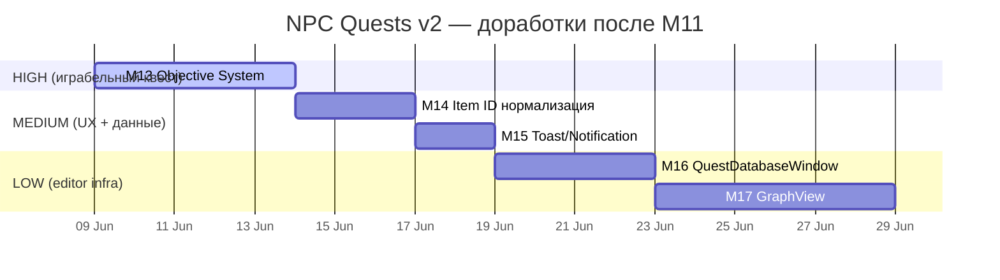

# 12 — GAP ANALYSIS: 5 критических пробелов + план доработки

> **Дата:** 2026-06-08
> **Статус:** Анализ завершён, план готов к утверждению
> **Отношение:** Расширяет `08_ROADMAP.md` — дополняет секции M13-M17

---

## 5 пробелов — что в текущем roadmap

| # | Пробел | Есть в roadmap? | Статус |
|---|--------|-----------------|--------|
| 1 | **Objectives не проверяются** (авто-прогресс) | ❌ НЕТ ни одного тикета | **Пропущен** — надо добавлять M13 |
| 2 | **Нет QuestDatabaseWindow** (IDE-style explorer) | 🟡 T-Q09 partial + T-Q09b deferred | M10 partial, не закончен |
| 3 | **Нет GraphView** (визуальный редактор диалогов) | ⏭️ T-Q09b DEFERRED | Отложен на неопределённое время |
| 4 | **Нет тостов/уведомлений** | ❌ НЕТ ни одного тикета | **Пропущен** — надо добавлять M15 |
| 5 | **Item id string↔int конвертация** | ❌ НЕТ ни одного тикета | **Пропущен** — надо добавлять M14 |

**Из 5 пробелов — 3 даже не учтены в roadmap.** Это не ошибка планирования — roadmap создавался до того как эти проблемы проявились в реальном тесте M11.

---

## План доработки (новые milestones M13-M17)

### M13 — Objective System (real-time проверка) — 🟡 HIGH PRIORITY

**Почему:** Сейчас квест прогрессирует ТОЛЬКО через dialog action `CompleteObjective`. Если квест многостадийный — игрок должен каждый раз возвращаться к NPC и кликать "я сделал". Objectives должны проверяться автоматически.

**Что нужно сделать:**

#### T-Q20 — QuestTriggerService.Evaluate real-time loop
- `QuestWorld.Tick()` — вызывается из `QuestServer.FixedUpdate` каждые 5 секунд
- Для каждого активного квеста каждого игрока:
  - Проверить все objectives текущей stage
  - `TalkToNpc` — `HasNpcTalkedTo(clientId, targetNpcId)` — уже есть в QuestWorld
  - `HaveItem` — `InventoryWorld.CountOf(clientId, itemTradeItemId) >= requiredQuantity`
  - `ReachLocation` — `Vector3.Distance(playerPos, targetPosition) < targetRadius`
  - `EventDriven` — `HasEventOccurred(clientId, eventId)` — уже есть
- Если все required objectives satisfied → stage complete → `onCompleteActions[]` fire
- Если есть `nextStageId` → переход на следующую стадию

**Сложность:** medium (~2-3 ч)
**Файлы:** QuestServer.cs, QuestWorld.cs, QuestObjective.cs, InventoryWorld.cs
**Риски:** polling каждые 5с — нагрузка на сервер (не критично для MVP)

#### T-Q21 — Objective progress DTO + UI
- Добавить в `QuestProgressDto` список completed objective IDs
- UI: в CharacterWindow → таб КВЕСТЫ → показывать checkmarks у выполненных objectives
- Tracker: показывать прогресс "2/3 дневников собрано"

**Сложность:** small (~1 ч)
**Файлы:** QuestProgressDto.cs, QuestClientState.cs, CharacterWindow.cs, QuestTracker.cs

#### T-Q22 — Stage transitions + onEnterActions/onCompleteActions
- При завершении stage: выполнить `onCompleteActions[]`
- При входе в новую stage: выполнить `onEnterActions[]`
- Отправить snapshot клиенту (обновлённый currentStageId)

**Сложность:** small (~1 ч)
**Файлы:** QuestWorld.cs, QuestServer.cs

**Итого M13:** ~4-5 ч, medium risk.

---

### M14 — Item ID нормализация — 🟡 MEDIUM PRIORITY

**Почему:** Сейчас 2 несвязанные системы:
- `TradeItemDefinition` (string itemId) — для экономики/маркета
- `ItemData` (int id) — для инвентаря/пикапов

Quest диалоги используют `stringParam` в условиях/действиях. Inventory использует `int itemId`. Конвертация через `int.TryParse` — хрупка.

#### T-Q23 — ItemRegistry (единый реестр)
- Создать `ItemRegistry` (server-side singleton, загружается из `Resources/Items/`)
- Каждый `ItemData` получает автоматический int id при регистрации (как сейчас)
- Добавить `ItemData.tradeItemId` (string, опционально) для связи с TradeItemDefinition
- `ItemRegistry.GetItemId(string tradeItemId)` → int
- `ItemRegistry.GetTradeItemId(int itemId)` → string

**Сложность:** small (~1 ч)
**Файлы:** ItemRegistry.cs (NEW), InventoryWorld.cs, QuestServer.cs (TakeItem/GiveItem — использовать ItemRegistry)
**Риски:** низкий

#### T-Q24 — Dialog action ItemType parameter
- В `DialogueAction` добавить `itemTypeParam` (byte, enum `ItemType`)
- `TakeItem`/`GiveItem` используют его вместо хардкода `Resources`
- `AssetPostprocessor` валидация: если `itemTypeParam == 0 → Resources`

**Сложность:** small (~0.5 ч)
**Файлы:** DialogueAction.cs, QuestServer.cs (GiveItem/TakeItem switch)

#### T-Q25 — PickupItem нормализация
- `PickupItem` хранит `itemData` (ItemData SO) + `itemId` (int)
- При спавне: `itemId = ItemRegistry.GetItemId(itemData.tradeItemId) ?? itemData.GetInstanceID()`
- Убрать прямой `itemId` из PickupItem — использовать `itemData` как единственный источник

**Сложность:** small (~1 ч)
**Файлы:** PickupItem.cs, InventoryServer.cs (RequestPickupRpc)
**Риски:** сломает существующие пикапы в сцене (их всего 3: AncientKey, TimeCrystal, остальные Key_Red/Blue/Green)

**Итого M14:** ~2.5 ч, low risk.

---

### M15 — Toast/Notification System — 🟡 MEDIUM PRIORITY

**Почему:** Игрок не видит:
- "Новый квест: Найти Кристалл Времён"
- "Древний Ключ получен"
- "+1000 кредитов, +25 репутации"

Сейчас всё — только в Console. Игрок не знает что происходит.

#### T-Q26 — QuestToast (UI Toolkit floating notification)
- Создать `QuestToast.uxml/.uss` (по аналогии с `QuestTracker.uxml`)
- 3 типа: `info` (синий), `success` (зелёный), `fail` (красный)
- Анимация: slide-in сверху → 3 секунды → slide-out
- Синглтон `QuestToastManager` в BootstrapScene

**Сложность:** medium (~2 ч)
**Файлы:** QuestToast.uxml, QuestToast.uss, QuestToastManager.cs
**Риски:** низкий (UI Toolkit toast — решённая задача, есть референсы)

#### T-Q27 — Server→Client notification RPC
- `QuestServer` отправляет toast при ключевых событиях:
  - `OnQuestDiscovered` → "Новый квест: Найти Кристалл Времён"
  - `OnQuestAccepted` → "Квест принят: Найти Кристалл Времён"
  - `OnQuestCompleted` → "Квест выполнен: Найти Кристалл Времён"
  - `OnQuestTurnedIn` → "+1000 CR, +25 репутации, Древний Свиток"
- Client RPC: `ReceiveQuestToastTargetRpc(string message, ToastType type)`

**Сложность:** small (~1 ч)
**Файлы:** QuestServer.cs, NetworkPlayer.cs, QuestToastManager.cs

**Итого M15:** ~3 ч, low risk.

---

### M16 — QuestDatabaseWindow (Editor Tool) — 🟡 LOW PRIORITY

**Почему:** Сейчас редактирование — через Project window → Inspector. Нет сводного обзора всех NPC/квестов/диалогов. Для продакшена (50+ NPC, 200+ квестов) — критично.

#### T-Q28 — QuestDatabaseWindow (UI Toolkit EditorWindow)
- Реализовать то что описано в `03_EDITOR_TOOLING.md`:
  - Left pane: TreeView (Factions → NPCs → Quests)
  - Center pane: Detail view (NPC: quests given/required, rewards, dialogs)
  - Right pane: read-only Properties (SerializedObject)
  - Toolbar: search, faction filter, validate button
- `QuestIndexBuilder` — строит кеш из AssetDatabase.FindAssets
- `QuestAssetWatcher` — AssetPostprocessor для авто-инвалидации

**Сложность:** large (~4 ч)
**Файлы:** QuestDatabaseWindow.cs, QuestDatabaseWindow.uxml, QuestDatabaseWindow.uss (NEW)
**Риски:** средний (UI Toolkit EditorWindow — стабильное API, но layout сложный)

---

### M17 — GraphView (DialogTree visual editor) — 🟡 LOWEST PRIORITY

**Почему:** Визуальное редактирование dialog tree — удобно, но не критично для MVP. Текстовый JSON в SO + Inspector — работоспособно.

#### T-Q29 — GraphView sub-tab
- Sub-tab в QuestDatabaseWindow
- `UnityEditor.Experimental.GraphView` с `DialogueNodeView` + `DialogueEdgeView`
- Sync: GraphView ↔ SO data (node positions, edges, conditions)
- Save: OnDestroy или manual "Save" button

**Сложность:** very large (~6-8 ч)
**Файлы:** QuestDatabaseWindow.cs (extend), DialogueNodeView.cs, DialogueEdgeView.cs (NEW)
**Риски:** высокий (GraphView API experimental, могут быть breaking changes в Unity 6.x)

---

## Обновлённый roadmap (M13-M17)

```
M11 — End-to-end demo       🟡  Текущий
M12 — Input remap E↔F       ⏭️  T-X4 (post-demo)

M13 — Objective System      🟡  HIGH — 3 тикета, ~5 ч
  T-Q20 — QuestTriggerService.Evaluate real-time
  T-Q21 — Objective progress DTO + UI
  T-Q22 — Stage transitions + onEnter/onComplete

M14 — Item ID нормализация  🟡  MEDIUM — 3 тикета, ~2.5 ч
  T-Q23 — ItemRegistry (string↔int)
  T-Q24 — Dialog action ItemType parameter
  T-Q25 — PickupItem нормализация

M15 — Toast/Notification    🟡  MEDIUM — 2 тикета, ~3 ч
  T-Q26 — QuestToast (UXML/USS)
  T-Q27 — Server→Client notification RPC

M16 — QuestDatabaseWindow   🟡  LOW — 1 тикет, ~4 ч
  T-Q28 — EditorWindow + IndexBuilder + AssetWatcher

M17 — GraphView             ⏭️  LOWEST — 1 тикет, ~6-8 ч
  T-Q29 — visual DialogTree editor
```

## График по приоритетам



## Рекомендация

**Делать по порядку приоритета:**

1. **Сначала M13** (Objective System) — без неё любой многостадийный квест требует ручного диалога. Это блокер для нормальных квестов.
2. **Потом M15** (Toast) — игрок должен видеть что происходит.
3. **Потом M14** (Item ID) — технический долг, но не блокирует контент.
4. **M16 + M17** — только когда контент-пайплайн упирается в отсутствие инструментов.

**Текущий M11 (demo)** — можно завершить имеющимися фиксами. Objectives, toasts и item id — улучшения, не блокеры.
