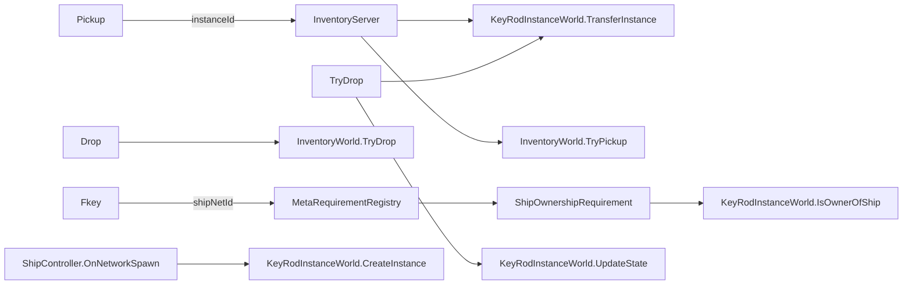

# 29_KEY_REFACTOR_PLAN.md — Полный рефакторинг

**Дата:** 2026-06-19 | **Автор:** Mavis | **Статус:** 📋 В реализации

---

## §1. Что меняем

| Было | Стало | Причина |
|---|---|---|
| 5 reflection вызовов в InventoryWorld/InventoryServer | **0 reflection** — прямой using | Performance, compile safety |
| `KeyRodInstanceBinding` (MonoBehaviour, scene-placed) | **Удалён** — ShipController сам создаёт instance в `OnNetworkSpawn` | Race condition, complexity |
| `ShipOwnershipRequirement` (NetworkBehaviour, MetaRequirement) | **Сохраняем** — but с прямым вызовом `KeyRodInstanceWorld.IsOwnerOfShip` (reflection removed) | Уже не понадобится после рефакторинга |
| `_keyIds` / `_keySlots` параллельные списки | **`_keyIds` вычисляется из `_keySlots`** на лету | Serialization bug, maintainability |
| UI reflection fallback (3 места) | **Прямой вызов** `KeyRegistry.GetInstance(instanceId)` + `ShipController` lookup | Performance, maintainability |

---

## §2. Новая архитектура (упрощённая)

**Ключевые принципы:**
1. **KeyRodInstanceWorld — single source of truth** для всех операций с ключами
2. **Никакой reflection** — прямой вызов через `using ProjectC.Ship.Key`
3. **keyIds вычисляется из keySlots** — один источник для ItemType.Key
4. **Scene-placed binding не нужен** — ShipController сам создаёт instance при спавне

---

## §3. Файлы по файлам

### Phase C: Замена reflection на прямые вызовы (5 файлов)

| Файл | Изменение |
|---|---|
| `InventoryWorld.cs` | + `using ProjectC.Ship.Key;`. Замена `typeof(KeyRodInstanceWorld).GetMethod(...).Invoke()` на прямой `KeyRodInstanceWorld.CreateInstance()` / `.TransferInstance()` / `.UpdateState()` |
| `InventoryServer.cs` | + `using ProjectC.Ship.Key;`. Замена `Type.GetType("...").GetMethod("TransferInstance")` на прямой `KeyRodInstanceWorld.TransferInstance()` |

### Phase D: InventoryData serialization fix

| Файл | Изменение |
|---|---|
| `InventoryData.cs` | `GetIdsForType(ItemType.Key)` → возвращает `_keySlots?.Select(s => s.itemId).ToList()` |

### Phase E: Удаление KeyRodInstanceBinding + ShipController auto-create

| Файл | Изменение |
|---|---|
| `ShipController.cs` | `OnNetworkSpawn()` server-only: создаёт instance через `KeyRodInstanceWorld.CreateInstance(...)` |
| `PickupItem.cs` | Убрать `GetComponent<KeyRodInstanceBinding>()` — instanceId передаётся через другой механизм |
| `KeyRodInstanceBinding.cs` | **Удалён** — больше не нужен |

---

## §4. Реализация

### Шаг 1: InventoryWorld — reflection → direct call
### Шаг 2: InventoryServer — reflection → direct call
### Шаг 3: InventoryData — serialization fix
### Шаг 4: ShipController — auto-create instance
### Шаг 5: PickupItem — удалить KeyRodInstanceBinding
### Шаг 6: UI — удалить reflection fallback'и
